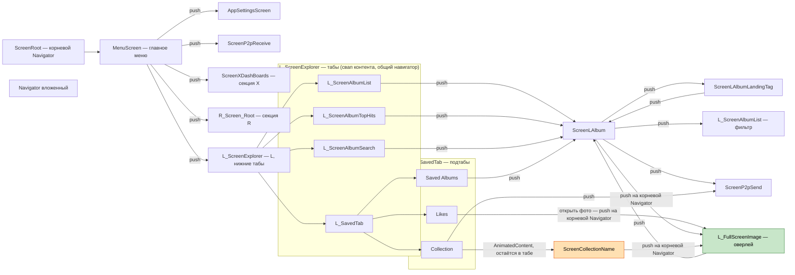

# Навигация (Voyager)

Карта навигации приложения: корневой `Navigator`, секции X / L / R, табы
L-раздела, вложенный навигатор коллекции и fullscreen-оверлей.

- **Оранжевым** — декларативный переход `AnimatedContent` (`L_CollectionNameContent`)
  внутри collection-таба (открытая коллекция остаётся в области таба, нижние
  навбары видны, без оверхеда вложенного Navigator).
- **Зелёным** — `L_FullScreenImage`: глобальный оверлей, пушится на
  **корневой** навигатор (`LocalMainNavigator`), поэтому кроет весь экран из
  любого вложенного контекста.

## Заметки

- L-табы (`AlbumList / SavedTab / TopHits / Search`) — это свап контента
  (`when(screenType) { ... .Content() }`) в **одном** навигаторе, не вложенные
  навигаторы. Поэтому push из них (например `ScreenLAlbum`) кроет весь экран.
- В collection-табе навигация между сеткой и содержимым переведена на декларативный
  `AnimatedContent` с плавным fading-переходом (плавное растворение/появление)
  и сессионным кэшем данных. Это устранило оверхед вложенного Navigator и баг
  промигивания элементов ранее открытой коллекции.
- FigJam-версия (онлайн, редактируемая):
  https://www.figma.com/board/QVsa8oJOkWrFfdCP7FGNi1
