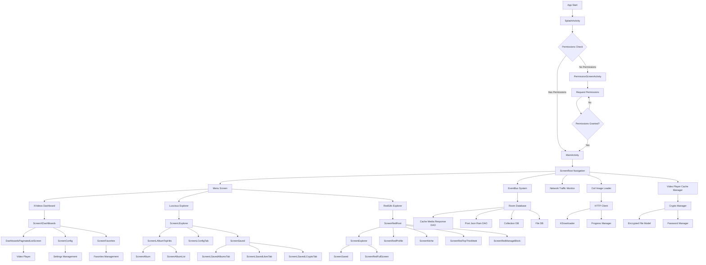
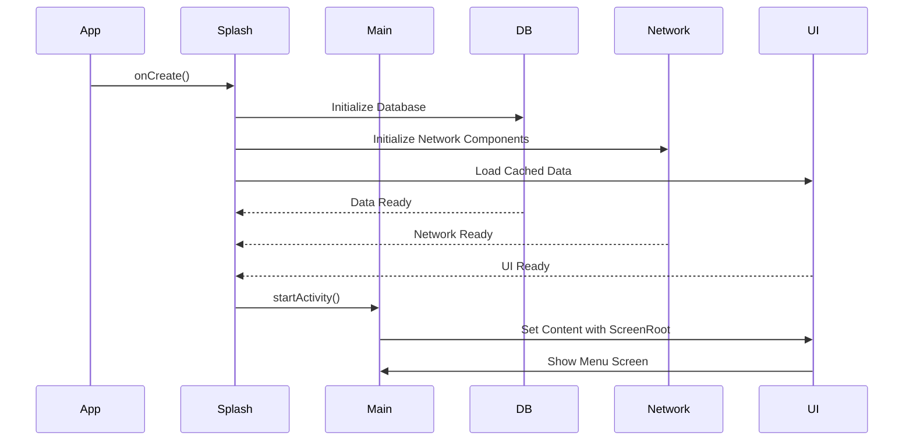
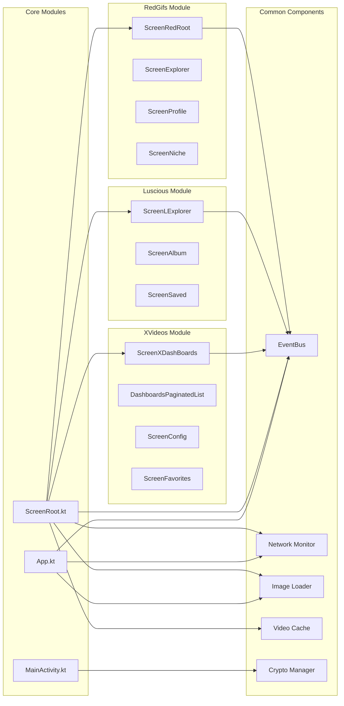
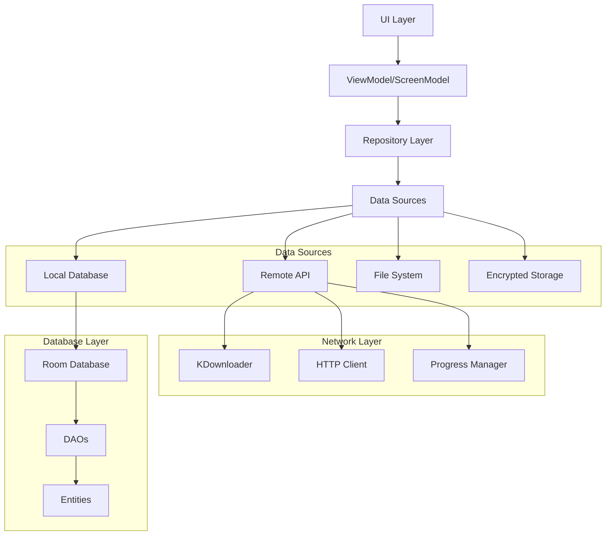
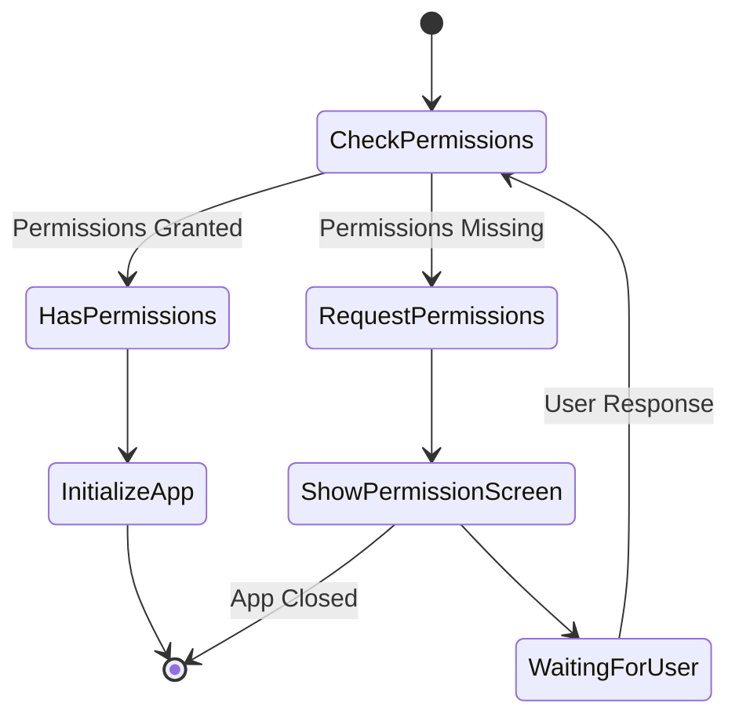

# Android XVideos App - Flowchart

## Application Architecture Flow

## Application Startup Sequence

## Module Dependencies

## Data Flow Architecture

## Permission Flow

## Key Components Overview

### 1. **Application Entry Points**
- `SplashActivity`: App initialization and data loading
- `MainActivity`: Main UI container with navigation
- `PermissionScreenActivity`: Permission management

### 2. **Navigation Structure**
- `ScreenRoot`: Root navigation container
- `MenuScreen`: Main menu with three module options
- Module-specific navigators for each content type

### 3. **Content Modules**
- **XVideos**: Video content from xvideos.com
- **Luscious**: Image content from luscious.net
- **RedGifs**: GIF content from redgifs.com

### 4. **Common Infrastructure**
- **EventBus**: Inter-component communication
- **Network Monitor**: Traffic statistics
- **Image Loading**: Coil-based image management
- **Video Caching**: ExoPlayer with cache management
- **Encryption**: File encryption/decryption
- **Database**: Room-based local storage

### 5. **Data Management**
- **Remote APIs**: HTTP-based content fetching
- **Local Cache**: Room database for offline access
- **File Storage**: Encrypted local file management
- **Download Manager**: Background file downloading

## Technology Stack

- **UI Framework**: Jetpack Compose
- **Navigation**: Voyager
- **Dependency Injection**: Hilt
- **Database**: Room
- **Image Loading**: Coil
- **Video Player**: ExoPlayer
- **Networking**: OkHttp + Custom HTTP Client
- **Encryption**: Custom Crypto Implementation
- **Architecture**: MVVM with ScreenModel pattern
